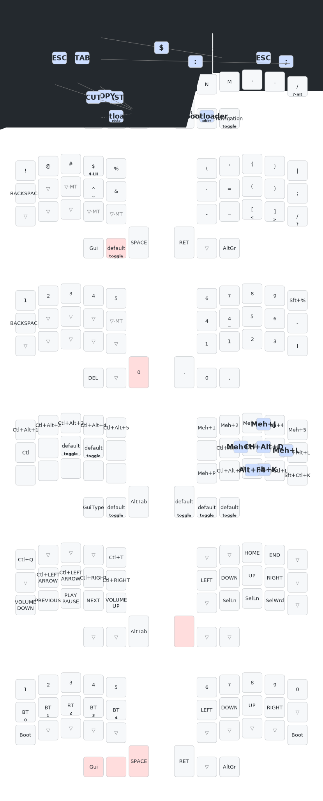

# Corne Keyboard Firmware

## 🐳 Quick Start (Docker - Recommended)

**Prerequisites**: Docker Desktop or Docker Engine

```bash
# 1. Setup workspace (downloads ZMK, Zephyr, etc.)
just setup

# 2. Build firmware for both sides
just build

# 3. Flash firmware (put keyboard in bootloader mode first)
just flash
```

That's it! The Docker environment handles all dependencies automatically.

## Available Commands

### Essential Commands
```bash
just setup           # Initialize ZMK workspace (run first)
just build            # Build firmware for both sides
just build-left       # Build only left side
just build-right      # Build only right side
just clean            # Clean build artifacts
```

### Development Commands
```bash
just shell            # Open interactive shell in container
just update           # Update ZMK to latest version
just rebuild          # Rebuild Docker image from scratch
just validate         # Check keymap syntax
just info             # Show build status and info
```

### Utility Commands
```bash
just flash            # Auto-detect and flash firmware
just quick            # Clean + build + show info
just dev              # Update + build
```

## Development Workflow

```bash
# First time setup
just setup

# Regular development
just build            # Build both sides
# or
just build-left       # Build specific side

# Clean rebuild
just clean build

# Update ZMK and rebuild
just dev

# Check everything is working
just info
```

## Firmware Files

Built firmware appears in `firmware/`:
- `corne_left_latest.uf2` - Latest left side firmware
- `corne_right_latest.uf2` - Latest right side firmware
- `corne_left_YYYYMMDD_HHMMSS.uf2` - Timestamped builds

## Flashing

1. Put your keyboard in bootloader mode (double-tap reset button)
2. Copy the `.uf2` file to the mounted drive
3. The keyboard will automatically reboot with new firmware

## Configuration

- **Board**: nice_nano_v2 (nRF52840)
- **Shield**: Corne (36-key split keyboard)
- **Keymap**: `config/corne.keymap`
- **Config**: `config/corne.conf`

## Troubleshooting

**Docker build fails?**
```bash
just rebuild          # Rebuild image from scratch
```

**Need to debug build issues?**
```bash
just shell            # Open container shell
just validate         # Check keymap syntax
```

**Workspace issues?**
```bash
just clean            # Clean build artifacts
just setup            # Re-initialize workspace
```

## Technical Details

This build system uses the official ZMK Docker image (`zmkfirmware/zmk-build-arm:stable`) - the same environment used by ZMK's GitHub Actions. This ensures maximum compatibility and stability.

### Direct Docker Commands (if `just` is not available)
```bash
./scripts/docker-build.sh setup
./scripts/docker-build.sh build
./scripts/docker-build.sh build left
./scripts/docker-build.sh shell
```

## Features

- ✅ **Stable Docker Build**: Uses official ZMK build environment
- ✅ **Apple Silicon Support**: Works on ARM64 Macs
- ✅ **Automatic Dependencies**: No manual toolchain setup required
- ✅ **Timestamped Builds**: Automatic backup of firmware files
- ✅ **Interactive Debugging**: Shell access to build environment
- ✅ **Simple Commands**: Easy-to-remember `just` commands

Happy typing! 🎹⌨️

## Keymap Diagram

The current Corne keymap is rendered to SVG for quick reference:



Regenerate after editing `config/corne.keymap`:

```bash
just keymap
```
